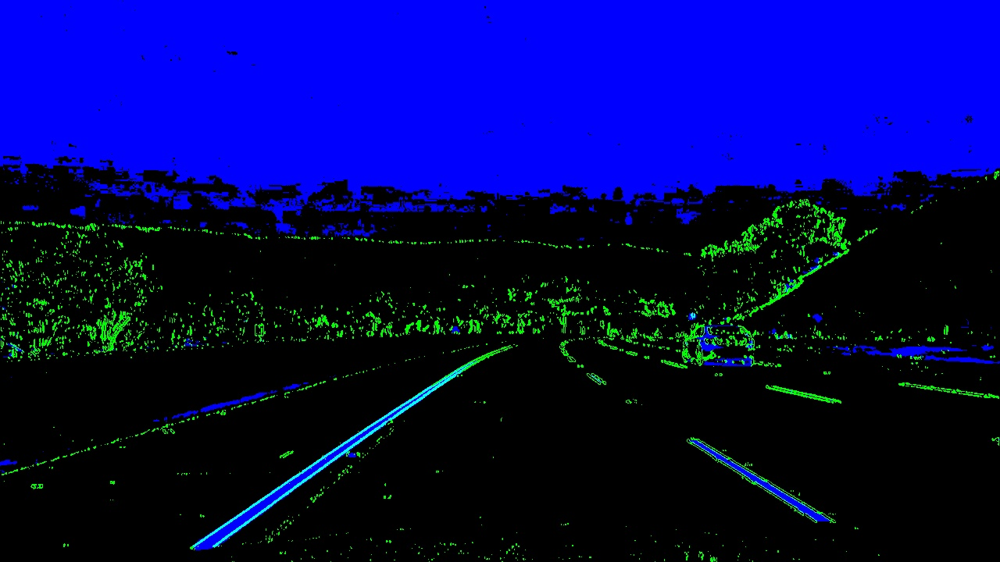
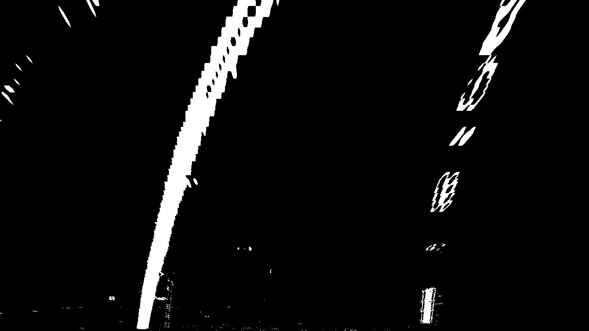
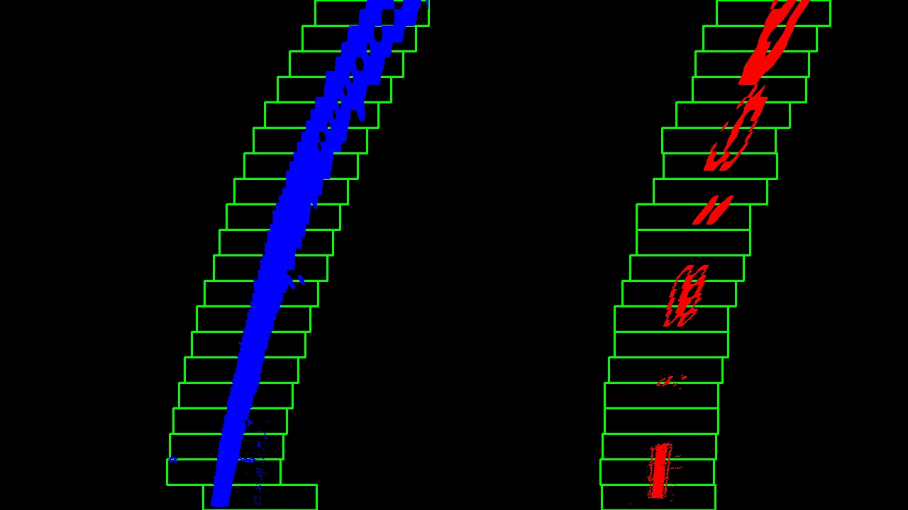
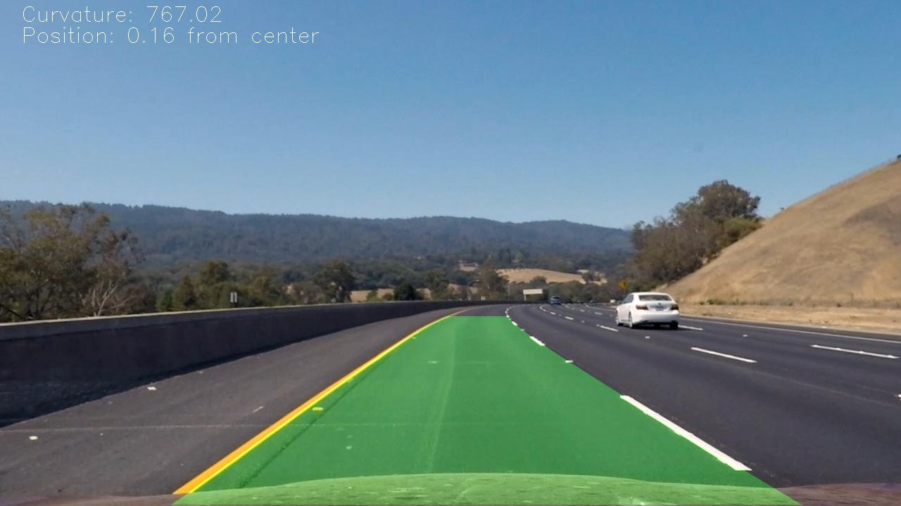

# Advanced Lane Line Finding

### Project #2 for Udacity Self-Driving Car Nanodegree

#### By Adam Gyarmati

---

### Overview: Advanced Lane Finding Project

This is a project I created for the Udacity Self-Driving Car Engineer Nanodegree. The goal was to build a pipeline of image processing functions that takes an image or video as input and outputs the image or video with lane lines marked and the curvature & distance from center calculated.

The goals / steps of this project were the following:

* Compute the camera calibration matrix and distortion coefficients given a set of chessboard images.
* Apply a distortion correction to raw images.
* Use color transforms, gradients, etc., to create a thresholded binary image.
* Apply a perspective transform to rectify binary image ("birds-eye view").
* Detect lane pixels and fit to find the lane boundary.
* Determine the curvature of the lane and vehicle position with respect to center.
* Warp the detected lane boundaries back onto the original image.
* Output visual display of the lane boundaries and numerical estimation of lane curvature and vehicle position.

My solution consists of three files:

* *P2_pipeline.py* contains the pipeline for image/video processing
* *AdvancedLaneFinding.py* contains class and function definitions for the pipeline and for image/video processing
* *test.py* runs image/video processing based on input parameters

I imported *AdvancedLaneFinding.py* as *alf* in the pipeline to access the defined functions.

Each step of the image/video processing pipeline is detailed below.

### Camera Calibration

#### The goal here is to calculate the camera matrix and distortion coefficients. An example of a distortion corrected calibration image is provided below.

The function used for this step can be found in the *AdvancedLaneFinding.py* file. 

I start by preparing "object points", which are the (x, y, z) coordinates of the chessboard corners in the real world. Here I am assuming the chessboard is fixed on the (x, y) plane at z=0, such that the object points are the same for each calibration image.  Thus, `objp` is just a replicated array of coordinates, and `objpoints` will be appended with a copy of it every time I successfully detect all chessboard corners in a test image.  `imgpoints` will be appended with the (x, y) pixel position of each of the corners in the image plane with each successful chessboard detection.  

I then used the output `objpoints` and `imgpoints` to compute the camera calibration and distortion coefficients using the `cv2.calibrateCamera()` function. Since these parameters depend only on the camera itself, it is enough to calculate them before processing the video and then use the same parameters for all frames.

### Pipeline (single images)

Each step of the pipeline is described here and an example is provided using the following image as input for the pipeline:

#### 1. Distortion correction

Using the camera matrix and distortion coefficients calculated in the camera calibration step, the pipeline undistorts each image using the `cv2.undistort()` function. This was implemented in the `undistort()` function in *AdvancedLaneFinding.py*. Applying the distortion correction function to the test image gives the following result: 

#### 2. Threshold using color transforms and gradients

I used a combination of HLS-space color thresholds and x-gradient thresholds to generate a binary image (thresholding steps in `threshold()` function of *AdvancedLaneFinding.py*). The S-channel was used for the color threshold.

*Note: The threshold values largely affect the pipeline, so they must be optimized to get good results. My experience was that some thresholds that give good results on certain test images will not work well with others. In the end I ended up lowering the thresholds to make lane pixel detection more robust.*

Applying the `threshold()` function to the undistorted image, we get the following result (binary image):

#### 3. Perspective transform

A perspective transform is useful to detect the lane pixels and especially to fit curves on them. The transform warps the road image into a "birds-eye view", as if we were looking down on the road from above.

The transform was implemented in the `perspective_tr()` function (in *AdvancedLaneFinding.py*). The heart of this function is the `cv2.getPerspectiveTransform()` function which calculates the transform matrix based on given source and destination points. I also calculated the inverse matrix here, which is useful later when we warp the curves back onto the output image.

I chose the following source and destination points using a frame with a straight road section:

| Source        | Destination   | 
|:-------------:|:-------------:| 
| 595, 450      | 300, 0        | 
| 688, 450      | 900, 0        |
| 220, 720      | 300, 720      |
| 1105, 720     | 900, 720      |

I verified that my perspective transform was working as expected by drawing the `src` and `dst` points onto a test image and its warped counterpart to verify that the lines appear parallel in the warped image:

#### 4. Lane pixel detection & curve fitting

I detected lane pixels using two methods:

* scanning the image with "sliding windows"
* using previous fits to search near the already detected lane

The "sliding window" method uses a histogram of the lower half of the image to start the scan, and proceeds upward through the image based on where it finds a given amount of pixels. The method is implemented in the `sliding_windows()` function in *AdvancedLaneFinding.py*

After lane pixels are detected, a second degree polynomial is fit to the points using the function `fitpoly()` (in *AdvancedLaneFinding.py*), which uses the `polyfit()` function from the *NumPy* library.

If the lanes were already detected the pipeline uses the previous fits to search for lane pixels using the `search_around_poly()` function (in *AdvancedLaneFinding.py*).

The detected curve fits where stored using the Line() class, which is described in the video pipeline section.

A visualization of the sliding window method is visible below:

#### 5. Calculation of lane curvature & vehicle position

The curvature of the road is calculated in the `measure_curvature_real()`function (in *AdvancedLaneFinding.py*) using the following equation, which "converts" the pixel values to meters:

`x = mx / (my**2) * a * (y**2) + (mx / my) * b * y + c`,

where `x = a * (y**2) + b * y + c` is the parabola, and `mx` and `my` are the scale for the x and y axis.

The position of the vehicle is calculated using the `get_position()`function (in *AdvancedLaneFinding.py*). The function takes the base positions of the lanes, calculates the center point between them and returns the distance of the center point from the midpoint of the image.

#### 6. Draw lane lines, output curvature and vehicle position

Th function `draw_lanes()` (in *AdvancedLaneFinding.py*) takes the undistorted image, curves, position, curvature and inverse transformation matrix and outputs the original undistorted image with the following:

* lane lines marked with green
* curvature indicated in meters
* position of vehicle from lane center indicate in meters

The output for our example can be seen below:

---

### Pipeline (video)

The main difference between processing images and videos is that in case of videos, it is useful to store data from previous frames to facilitate lane finding.

For this I defined a class called `Line` (in *AdvancedLaneFinding.py*) with some attributes related to lane lines. I used instances of this class to store data about the frames in order to:

* decide whether to use the "sliding window" method or to search next to curves
* average the recent fits to smooth the curves
* use previous curves if the current fit doesn't look correct

Using the functions in *AdvancedLaneFinding.py* to build a pipeline in *P2_pipeline.py*, I got the following video as output:

Link to the output videos:

Track 1:
https://youtu.be/1CxWpKNqWIs

Track 2:
https://youtu.be/ishvYAyKT7E

---

### Discussion

After completing the Term 1 of the Self-Driving Car Nanodegree, I took some time to revisit this project and tried to improve it as much as I could. When I submitted the project originally, it only worked on the first track, but after some adjustments I managed to improve the lane detection so that it worked on the challenge video.

When testing on the hardest challenge video (with very different light conditions and sometimes non-visible lane marks), I got stuck for months trying to get it to work. Unfortunately my experience was that no matter how good the perception was, there was always a rule that had to be set up to eliminate falsely detected curves.

As a summary I learned the following from this project:
- the method used is fairly simple and works well on straight / slightly curvy roads with good lane visibility
- making it work for harsher environments requires LOTS of rules and simply isn't feasible
- because of this, in my opinion neural network approaches are far superior :)
